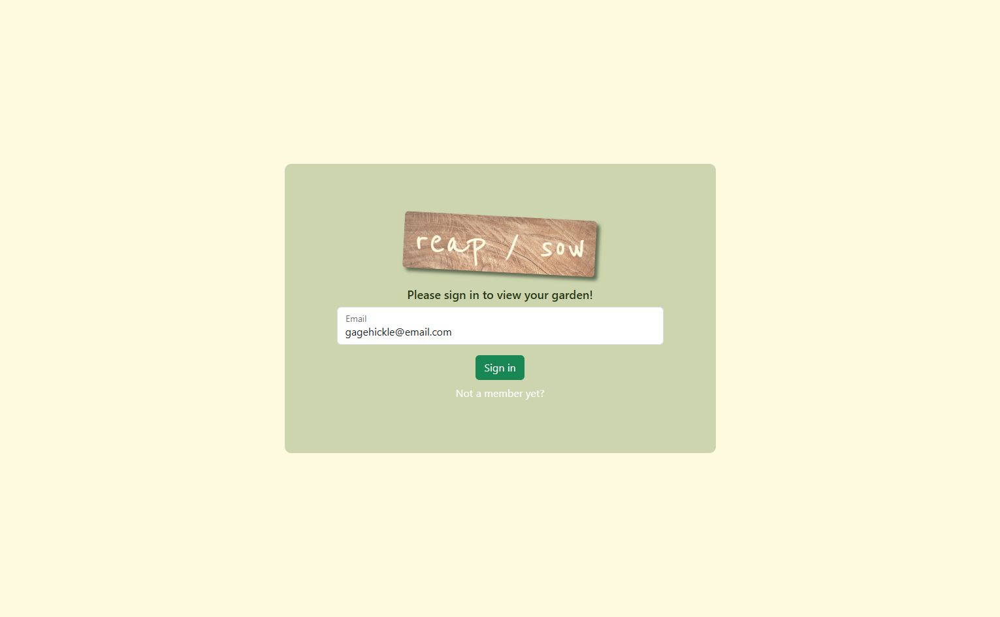
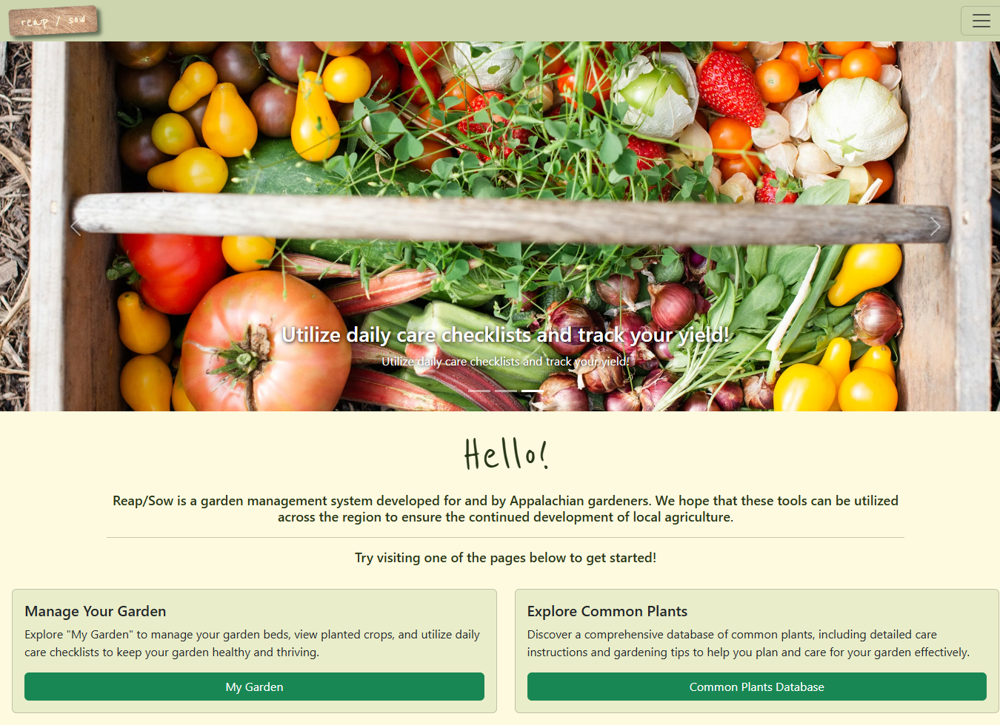
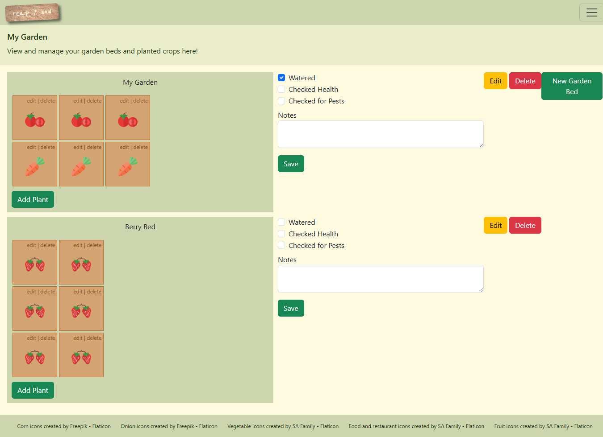
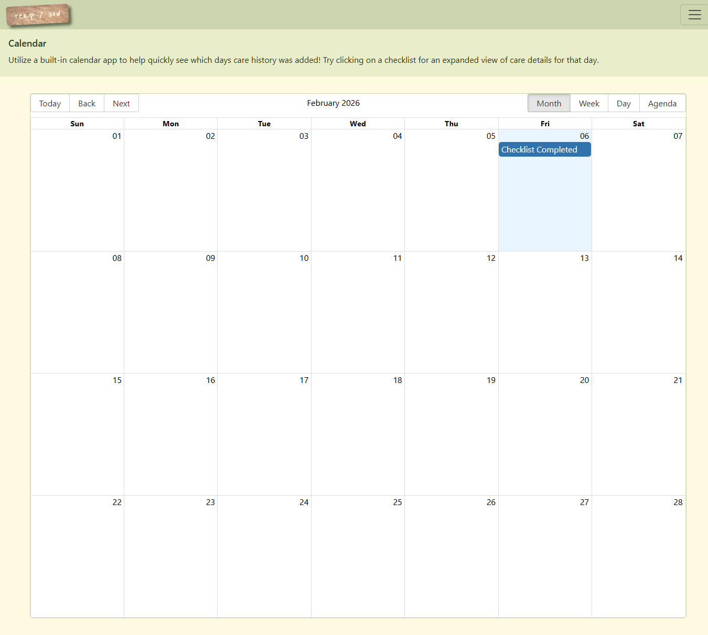
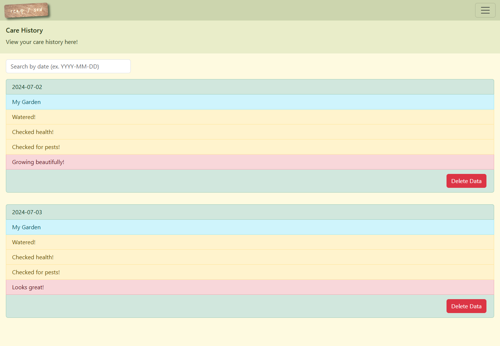
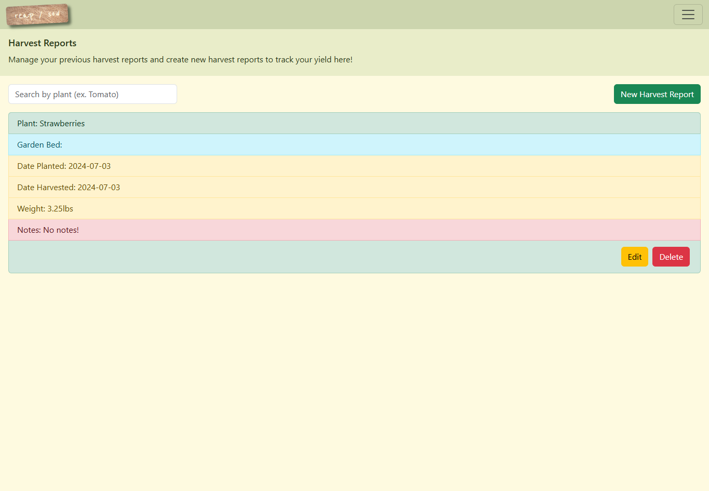
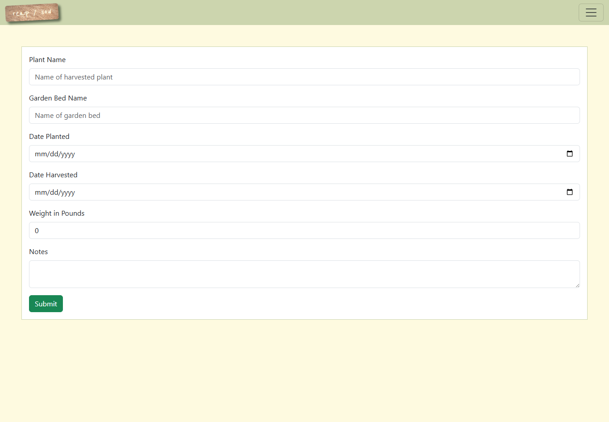
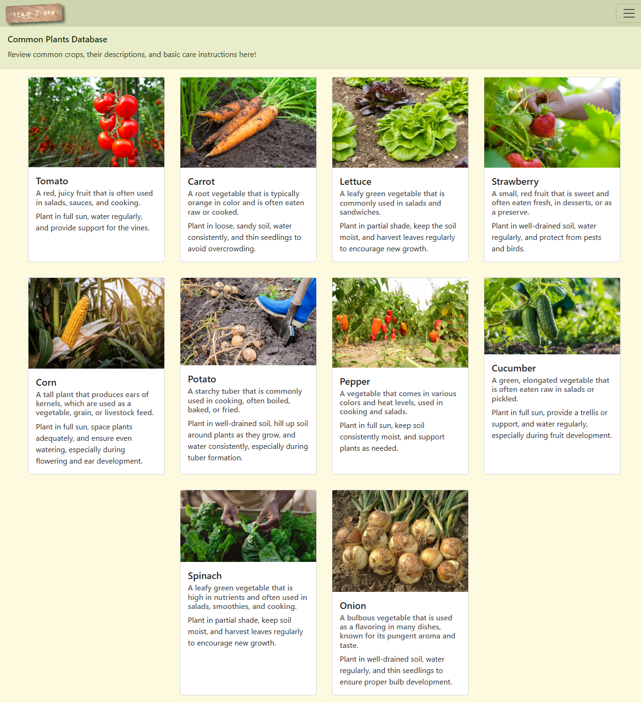

# Reap / Sow
## Overview
*Reap / Sow* is a React companion tool for gardeners designed to support day-to-day garden planning and care. The app allows users to:
- Map and organize garden beds visually through a grid system
- Track plant health and yields with a daily checklist
- Review historical care data using a calendar view
  
All data is handled via a mock JSON database with full CRUD functionality, simulating a backend API for local development and prototyping.

## Screenshots

### Login


### Welcome


### My Garden


### Care History Calendar


### Care History List


### Harvest Reports


### Harvest Form


### Plants Database


## Installation
### Install Dependencies:
- Ensure you have Node.js installed.

### Clone the Repository:
```
git clone https://github.com/jessicasturgell/reap-sow.git
cd reap-sow
```

### Start the Mock Database
```
json-server -p 8088 api/database.json
```

### Start the Client:
```
npm install
npm run dev
```

### Access the Application:
- Copy the localhost link displayed in the terminal and paste it into your browser to start using the application.
